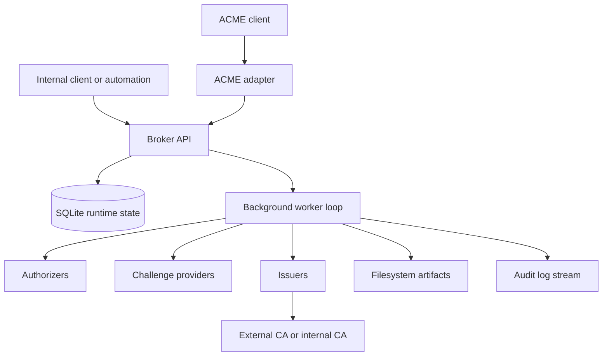
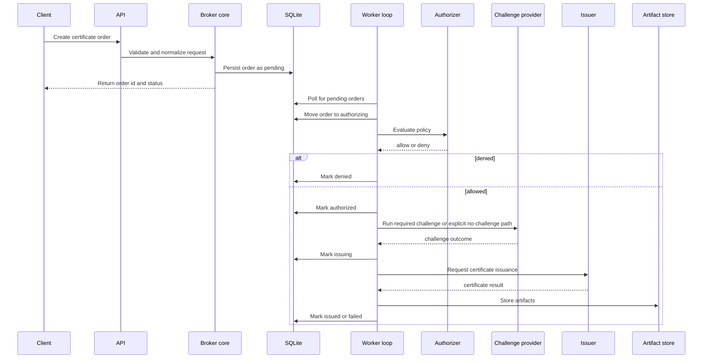

# acmed Architecture

> [!TIP]
> **TL;DR**
> `acmed` should be a small broker-first certificate issuance service. The broker owns the request lifecycle and policy decisions, ACME stays an adapter, and the MVP should favor a lean single-service architecture over layered indirection.

## 1. Objective

Build a Python service that centralizes certificate issuance decisions for internal infrastructure while keeping authorization policy, challenge execution, issuance, storage, and ACME compatibility clearly separated.

The architecture should optimize for:

- minimal code volume
- low runtime overhead
- clear failure handling
- fast local development
- easy future extension without paying extension cost up front

## 2. Scope

In scope:

- internal broker API for certificate requests
- asynchronous order processing
- pluggable authorizers, challenge providers, and issuers
- YAML configuration
- SQLite runtime state
- filesystem artifact storage
- audit logging
- optional ACME-compatible adapter

Out of scope for v1:

- full RFC-complete ACME support
- HA clustering
- distributed queues
- web UI
- advanced multi-tenant isolation

## 3. Architecture Principles

### 3.1 Broker-first, not ACME-first

The internal domain model must describe certificate brokering, not ACME protocol mechanics. ACME accounts, orders, authorizations, and challenges belong to the adapter layer and must translate into broker concepts rather than reshape them.

### 3.2 Authorization is distinct from challenge validation

An order may be approved by policy before any external validation occurs. A challenge may still be required for a selected issuer. A no-challenge path must be an explicit policy-backed branch in the model.

### 3.3 Simplicity-first implementation

For the MVP, prefer:

- one deployable service
- SQLite as both runtime store and work coordination source
- a polling worker loop instead of a separate queue system
- direct function calls instead of event buses or stacked service frameworks
- a few coarse-grained modules over many tiny packages

### 3.4 Security-by-default

The MVP should remain lean, but it must not depend on later hardening for basic safety. Secure defaults should exist in the initial design, especially for:

- transport security
- requester identity
- policy evaluation
- secret handling
- subprocess isolation
- audit redaction
- abuse controls

## 4. System Overview

## 4.1 Core Components

| Component | Responsibility |
|----------|-----------------|
| API layer | Hosts broker endpoints, health endpoints, and an optional ACME adapter |
| Broker core | Normalizes requests, applies policy, drives state transitions, and records audit events |
| Worker loop | Polls SQLite for pending work and performs authorization, challenge execution, and issuance |
| Plugin set | Small interfaces for authorizers, challenge providers, and issuers |
| Storage | SQLite for state and filesystem paths for artifacts |

Avoid introducing registry classes, queue abstractions, or orchestration frameworks unless the MVP proves they are needed.

## 4.2 System Context



## 4.3 Recommended Lean Package Layout

Start with a compact layout and split modules only when they become hard to maintain:

```text
src/acmed/
  main.py
  api.py
  acme_api.py
  auth.py
  config.py
  models.py
  policy.py
  storage.py
  worker.py
  audit.py
  issuers/
    base.py
    mock.py
    certbot.py
  challenges/
    base.py
    noop.py
    dns_hook.py
  authorizers/
    base.py
    subnet.py
    dns_resolves.py
```

`acme_api.py` should stay protocol-focused and should not absorb broker business rules.

## 5. Request Model

## 5.1 Primary Request Flow



## 5.2 Order Lifecycle

Required states:

- `pending`
- `authorizing`
- `authorized`
- `issuing`
- `issued`
- `failed`
- `denied`
- `expired`

Recommended transitions:

| From | To | Meaning |
|------|----|---------|
| `pending` | `authorizing` | Worker begins policy evaluation |
| `authorizing` | `authorized` | Policy evaluation succeeds |
| `authorizing` | `denied` | Policy evaluation rejects the request |
| `authorized` | `issuing` | Challenge completed or explicitly skipped by policy |
| `issuing` | `issued` | Issuer returns a successful result |
| `issuing` | `failed` | Issuance fails and no retry remains |
| `pending` | `expired` | Request timed out before processing |
| `authorized` | `expired` | Authorized order aged out before issuance |
| `failed` | `pending` | Optional retry path if explicitly supported |

Terminal states for v1 should be `issued`, `failed`, `denied`, and `expired`.

Keep the state machine minimal. Do not add states for every sub-step unless they materially improve operator visibility.

## 5.3 Broker-native vs ACME-native Challenge Handling

| Area | Broker-native workflow | ACME workflow |
|------|------------------------|---------------|
| Who requests issuance | Internal authenticated requester | ACME account client |
| Who fulfills challenge | Service may execute challenge provider logic | Client fulfills the challenge |
| Who validates challenge | Service or issuer path as configured | ACME adapter validates per ACME rules |
| Why it exists | Internal broker convenience and policy control | RFC 8555 interoperability |

This distinction must remain explicit in both code and tests.

## 6. Data and Storage Model

## 6.1 Core Data Model

### Order

Minimum fields:

- `id`
- `status`
- `requester_id`
- `request_source`
- `dns_names`
- `common_name`
- `issuer_name`
- `challenge_type`
- `private_key_policy`
- `csr_source`
- `not_before`
- `not_after`
- `created_at`
- `updated_at`
- `expires_at`
- `error_message`
- `dedupe_key`

### Authorization decision

Minimum fields:

- `order_id`
- `authorizer_name`
- `decision`
- `reason`
- `evidence`
- `evaluated_at`

### Issuance attempt

Minimum fields:

- `order_id`
- `issuer_name`
- `attempt_number`
- `command`
- `exit_code`
- `stdout_path`
- `stderr_path`
- `started_at`
- `finished_at`
- `result_code`

### Audit event

Minimum fields:

- `id`
- `order_id`
- `event_type`
- `actor_type`
- `actor_id`
- `message`
- `metadata`
- `created_at`

### Artifact set

Recommended files per order:

- `private.key`
- `request.csr`
- `certificate.pem`
- `chain.pem`
- `fullchain.pem`
- `issuer-output.log`
- `challenge-output.log`

For the MVP, prefer a small schema with a few well-chosen tables:

- `orders`
- `issuance_attempts`
- `audit_events`

Add dedicated tables for authorization details only if query requirements justify them.

## 6.2 Storage Model

### YAML configuration

Used for:

- server settings
- identity providers
- policy definitions
- issuer definitions
- challenge provider definitions
- ACME adapter settings
- storage paths
- worker settings

Rules:

- do not store long-lived plaintext secrets in committed YAML
- prefer secret references or environment-provided values for tokens, keys, and external credentials
- configuration validation should fail closed when required secret material is missing

### SQLite runtime state

Used for:

- orders
- state transitions
- issuer attempts
- audit events
- deduplication keys
- renewal tracking

SQLite should also serve as the worker coordination mechanism. A worker can claim rows using status changes and timestamps rather than relying on a separate message queue.

Rules:

- store only the minimum sensitive runtime data needed for correct operation
- if locally managed API tokens are stored, store only a salted hash
- avoid storing raw secrets in audit metadata or error fields

### Filesystem artifacts

Used for:

- generated keys
- CSRs
- returned certificates and chains
- per-order command output
- diagnostic logs that are too large for the database

Rules:

- write private key material only when explicitly required by the flow
- create artifact directories and files with restrictive permissions
- classify sensitive artifacts differently from public certificate material
- define retention or cleanup behavior for sensitive artifacts

## 6.3 Configuration Shape

Example:

```yaml
server:
  host: 0.0.0.0
  port: 8443
  tls_enabled: true

identity:
  api_tokens:
    enabled: true
  mtls:
    enabled: false

acme:
  enabled: true
  directory_path: /acme/directory
  supported_challenges:
    - http-01
    - dns-01
  revoke_cert_enabled: false
  key_change_enabled: false
  external_account_binding:
    enabled: false

storage:
  sqlite_path: data/acmed.db
  artifacts_root: data/orders

workers:
  poll_interval_seconds: 2
  max_parallel_orders: 4

issuers:
  - name: mock
    type: mock
  - name: letsencrypt
    type: certbot
    directory_url: https://acme-v02.api.letsencrypt.org/directory

challenge_providers:
  - name: no-challenge
    type: noop
  - name: dns-hook
    type: dns_hook
    command: /usr/local/bin/acmed-dns-hook

authorizers:
  - name: subnet-lab
    type: source_subnet
    source_subnets:
      - 10.20.30.0/24
  - name: dns-match
    type: dns_resolves_to_source

policies:
  - name: lab-network
    requester_match:
      authorizers:
        - subnet-lab
    allowed_domains:
      - "*.lab.example.org"
    issuer: letsencrypt
    challenge: dns-01
```

## 7. API Boundaries

## 7.1 Broker API

Responsibilities:

- create normalized certificate orders
- fetch order status and details
- list recent orders when helpful
- retrieve issuance results and artifact metadata

Suggested endpoints:

- `POST /api/v1/orders`
- `GET /api/v1/orders/<order_id>`
- `GET /api/v1/orders`

Security expectations:

- require HTTPS except for explicit localhost development mode
- authenticate every non-health endpoint
- authorize access to order details by requester identity or administrative privilege
- return minimal error detail to API clients while preserving richer diagnostics in protected audit trails

## 7.2 Admin API

Responsibilities:

- health and readiness
- worker visibility
- optional audit inspection

Suggested endpoints:

- `GET /admin/health`
- `GET /admin/ready`
- `GET /admin/orders/<order_id>/audit`

Security expectations:

- keep admin endpoints behind stronger access controls than regular broker endpoints
- never expose raw secrets, private keys, or challenge credentials through admin responses
- treat audit inspection as privileged access

## 7.3 ACME Adapter

The ACME adapter should:

- expose a standard ACME directory URL for external clients
- implement the documented supported ACME feature set
- map ACME order creation to broker order creation
- map authorization and challenge views to broker state
- avoid letting ACME semantics leak into core models

The authoritative ACME contract lives in [`acme-api-reference.md`](/workspaces/cfg-pi-wizzy/local/acmed/acme-api-reference.md).

Do not duplicate endpoint-by-endpoint behavior here. Keep this file focused on system design and let the ACME reference own protocol detail.

## 8. Plugin Model

### Authorizer contract

Inputs:

- requester identity
- request source metadata
- requested DNS names
- matching policy context

Output:

- allow or deny decision
- human-readable reason
- optional machine-readable evidence

### Challenge provider contract

Inputs:

- normalized order
- requested challenge type
- issuer context

Output:

- success or failure
- challenge evidence
- cleanup callback or cleanup result if relevant

This contract applies to broker-native workflows. It is not a substitute for ACME protocol challenge resources when serving external ACME clients.

### Issuer contract

Inputs:

- normalized order
- resolved policy
- challenge result
- artifact destination

Output:

- certificate material or artifact paths
- issuer metadata
- retryable vs non-retryable failure classification

Reference interface:

```python
class Issuer:
    def issue(self, order: Order) -> IssueResult:
        ...
```

The first implementation should keep this synchronous at the plugin boundary while the surrounding orchestration remains asynchronous.

Do not build plugin discovery or dynamic import machinery in v1. A static mapping from configured type name to implementation class is sufficient.

## 9. Security Model

### 9.1 Threat baseline

Design for at least these threats:

- unauthorized requesters attempting certificate issuance
- over-broad policy allowing unintended names
- bearer token leakage
- mTLS credential misuse
- malicious or malformed order input
- incompatible ACME protocol behavior causing client failure or unsafe fallback behavior
- issuer subprocess abuse or command injection
- leakage of secrets through logs, audit records, or artifact storage
- abusive order creation causing resource exhaustion

### 9.2 Transport and identity

- require TLS for deployed broker, admin, and ACME endpoints
- allow plain HTTP only for explicit localhost or isolated development mode
- if mTLS is enabled, bind requester identity to the verified client certificate rather than to untrusted headers
- evaluate authorization with deny-by-default behavior
- require explicit requester-to-domain authorization before issuance

### 9.3 Authorization safety

- policies should fail closed on parse errors, missing references, or ambiguous matches
- exact-name or tightly scoped domain rules are safer defaults than large wildcard grants
- "no challenge" should require an explicit high-trust policy path and should be auditable
- access to an existing broker order should be restricted to the original requester or an administrator

### 9.4 Secret handling

Do not log:

- private keys
- bearer tokens
- external account binding secrets
- raw mTLS key material

Additional rules:

- avoid echoing secrets into subprocess arguments when a safer input method exists
- redact secrets from exception messages before writing them to logs or audit events
- zero or discard sensitive temporary files as soon as practical
- prefer short-lived credentials over long-lived credentials when integrations allow it

### 9.5 Command execution

Command-based issuers must run through controlled subprocess wrappers with:

- explicit argument lists
- bounded execution time
- captured stdout and stderr
- structured exit handling
- fixed executable paths
- minimal sanitized environments
- isolated working directories and output paths

### 9.6 Artifact and audit protection

- redact secrets and credentials from audit events by default
- keep audit logs append-oriented and resistant to accidental overwrites
- store enough security-relevant context to explain decisions without copying secret-bearing payloads
- classify artifact files by sensitivity and apply permissions accordingly

### 9.7 Abuse controls

- rate-limit order creation per requester identity
- throttle repeated authentication failures
- cap concurrent work per issuer and optionally per requester
- reject obviously excessive SAN counts or request sizes early
- keep renewal and retry logic bounded to avoid loops

## 10. Operational Model

### 10.1 Runtime topology

The minimal deployment can run as:

- one process that hosts both the HTTP API and a background worker thread or task
- one shared SQLite database
- one shared artifacts directory

Security notes:

- run the service as a dedicated non-root user where possible
- keep database and artifact paths outside publicly served directories
- if the API and worker remain in one process, compensate with strict local filesystem permissions and conservative subprocess handling

### 10.2 Startup sequence

1. Load YAML configuration.
2. Validate plugin references, ACME settings, security settings, and storage paths.
3. Open or initialize SQLite schema.
4. Start the worker loop.
5. Start HTTP server.

### 10.3 Background processing expectations

- APIs should not block on long-running issuance.
- Workers should claim work atomically.
- In-progress orders should be recoverable after restart.
- Order state transitions must remain valid even if an external tool crashes.
- Security-sensitive failures should fail closed rather than silently downgrading behavior.

## 11. Testing and Validation

MVP tests should cover:

- state machine transition validity
- config loading and validation
- authorization policy evaluation
- deduplication behavior
- mock issuer success and failure paths
- worker retry and terminal failure handling
- filesystem artifact writing
- broker API request and status flows
- ACME adapter flows as defined in [`acme-api-reference.md`](/workspaces/cfg-pi-wizzy/local/acmed/acme-api-reference.md)
- real-client smoke tests with both `certbot` and `acme.sh` against the documented supported feature set
- authorization fail-closed behavior
- secret redaction in logs or audit events
- subprocess wrapper safety behavior
- access control on order reads and admin endpoints

Prefer a higher ratio of service-level and integration-style tests over a large volume of mock-heavy unit tests.

## 12. Constraints and Failure Modes

| Area | Risk | Expected handling |
|------|------|-------------------|
| SQLite locking | concurrent writers block each other | keep writes short and worker concurrency modest |
| External issuer command failure | non-zero exit or timeout | capture logs, classify failure, retry only when safe |
| DNS challenge propagation delay | validation races ahead of propagation | support wait or retry policy in challenge provider |
| Policy misconfiguration | over-broad authorization | fail closed where possible and surface config validation errors |
| Artifact write failure | certificate not persisted | keep order failed, preserve issuer result metadata, emit audit event |
| Restart during issuance | orphaned in-progress state | recover from persisted attempts and allow controlled retry |
| Token or credential leakage | unauthorized issuance or inspection | require TLS, redaction, hashed token storage, and secret minimization |
| Command injection through issuer input | arbitrary command execution | validate inputs, use explicit argv, avoid shell execution, and sanitize environment |
| Audit oversharing | secrets appear in logs or API output | redact by default and restrict audit access |

## 13. Delivery Shape

The recommended implementation phases live in [`implementation-guide.md`](/workspaces/cfg-pi-wizzy/local/acmed/implementation-guide.md).

This architecture document should stay focused on:

- system boundaries
- domain behavior
- runtime model
- storage model
- security model
- the separation between broker-native and ACME-native behavior

Keep process history and refinement history out of this file. That belongs in [`iteration-log.md`](/workspaces/cfg-pi-wizzy/local/acmed/iteration-log.md).
