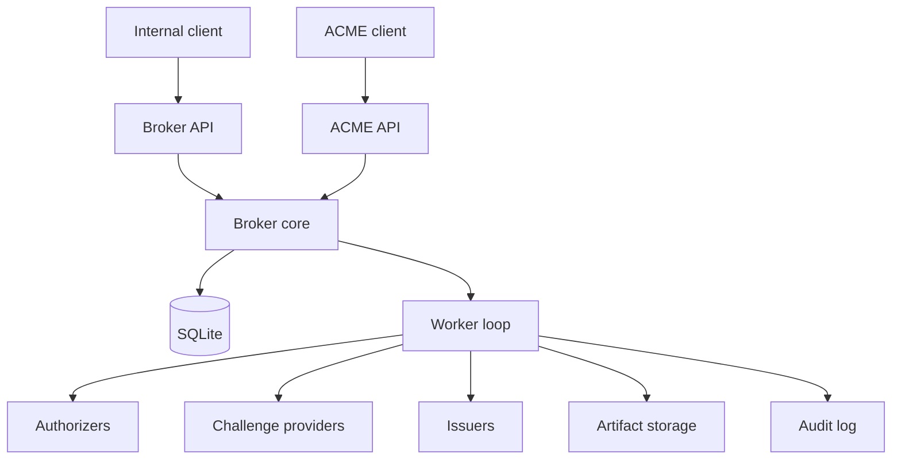
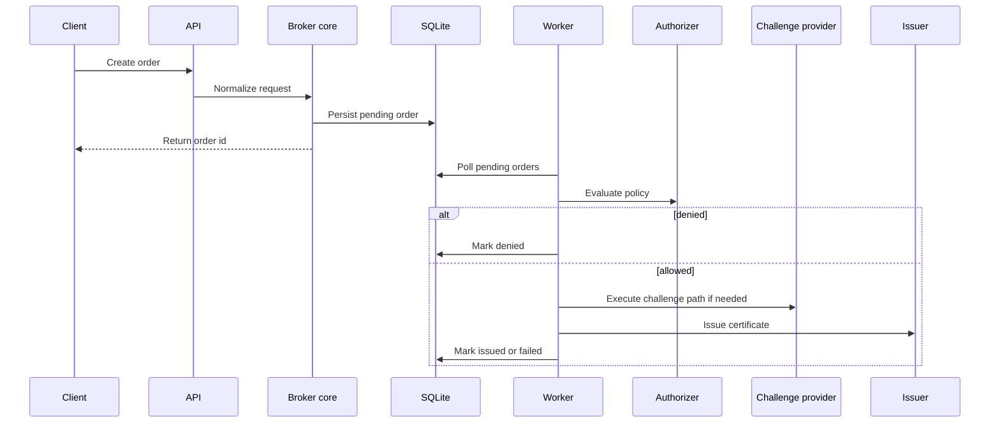

# acmed Architecture

> [!TIP]
> **TL;DR**
> `acmed` should be implemented as a modular monolith: an ACME-facing service around a broker-style core, a worker loop, small plugin boundaries, and an optional broker API for internal use.

Use this document as the source of truth for system shape, component boundaries, and package layout.

Owns: system shape, component boundaries, ACME-versus-broker separation, and package layout.

## 1. Objective

Build a certificate issuance service that centralizes policy decisions while staying small, fast, and understandable.

The architecture should optimize for:

- truthful ACME compatibility for the documented feature set
- minimal code volume
- low runtime overhead
- clear failure handling
- straightforward local development
- a core model that does not collapse into raw ACME protocol mechanics

## 2. Scope

In scope:

- ACME-compatible certificate ordering for the documented supported feature set
- asynchronous processing
- pluggable authorizers, challenge providers, and issuers
- persistent runtime state
- auditability
- broker-native certificate ordering as a secondary or optional interface

Out of scope for v1:

- full RFC-complete ACME support
- clustering or distributed queues
- UI
- advanced multi-tenant isolation

## 3. Architecture Principles

### 3.1 ACME-first at the edge, broker-style in the core

The external product surface should be ACME-first, but the internal domain model should still describe certificate brokering rather than mirroring ACME resources one-to-one.

### 3.2 Authorization and challenge validation are different

Internal policy answers whether a requester may ask for a certificate. Challenge validation answers whether an identifier has been proven in a particular issuance flow.

### 3.3 Simplicity-first implementation

For the MVP, prefer:

- one deployable service
- SQLite-backed work coordination
- a polling worker loop
- direct function calls over orchestration frameworks
- a few coarse-grained modules over many tiny packages

### 3.4 Security-by-default

Basic safety must exist in the first implementation, especially for:

- transport security
- requester identity
- secret handling
- subprocess isolation
- audit redaction

## 4. System Overview

### 4.1 Core Components

| Component | Responsibility |
|----------|-----------------|
| ACME API | Accept ACME requests and return ACME-visible resources and errors |
| Broker core | Normalize requests, apply policy, and drive state transitions |
| Worker loop | Poll for work and execute authorization, challenge, and issuance steps |
| Plugin set | Authorizers, challenge providers, and issuers |
| Storage | SQLite runtime state plus filesystem artifacts |
| Broker API | Expose a secondary broker-native contract for internal integrations when needed |

### 4.2 Context Diagram



### 4.3 Recommended Package Layout

```text
src/acmed/
  main.py
  api.py
  acme_api.py
  auth.py
  config.py
  models.py
  policy.py
  storage.py
  worker.py
  audit.py
  issuers/
  challenges/
  authorizers/
```

Split files only after they become materially too large.

For per-file responsibilities and implementation-oriented rules, use [`implementation-guide.md`](./implementation-guide.md).

`main.py` should act as the ACME-first runtime entrypoint:

- load configuration
- initialize storage
- start the worker loop
- construct the HTTP application
- expose the ACME routes, admin inspection endpoints, and health endpoints from one service process for the MVP
- mount the broker API in that same service process only when the secondary broker-native interface is enabled or required by the slice

Do not turn `main.py` into a framework-heavy bootstrap layer in the ACME-first milestone.

## 5. Core Flow

The same broker-style core flow should serve both the ACME interface and the optional broker API. ACME-specific resources such as accounts, authorizations, and challenges are protocol-facing projections over this shared workflow rather than a separate issuance engine.



## 6. Workflow Boundary: ACME vs Broker

| Area | ACME workflow | Broker-native workflow |
|------|---------------|------------------------|
| Request identity | ACME account key | Internal requester identity |
| Challenge actor | Client fulfills challenge | Service may execute challenge-provider logic |
| Validation style | RFC 8555-compatible ACME validation | Broker-controlled flow |
| Main purpose | External client compatibility | Internal policy-driven brokering |

The ACME surface is the primary product contract, but the broker core must stay independent of raw ACME semantics so both interfaces can share one honest implementation model.

## 7. Related Documents

For topic ownership and navigation, use [`../README.md`](../README.md).

Main companion documents:

- [`acme-api-reference.md`](./acme-api-reference.md): ACME-visible behavior
- [`data-model.md`](./data-model.md): lifecycle, persistence, and storage
- [`policy-config.md`](./policy-config.md): configuration and policy matching
- [`implementation-guide.md`](./implementation-guide.md): code-shape guidance and test expectations
- [`broker-api-reference.md`](./broker-api-reference.md): secondary broker-native HTTP behavior
- [`security-operations.md`](./security-operations.md): security defaults and runtime posture
- [`implementation-plan.md`](./implementation-plan.md): sequencing, iteration scope, and MVP completion
