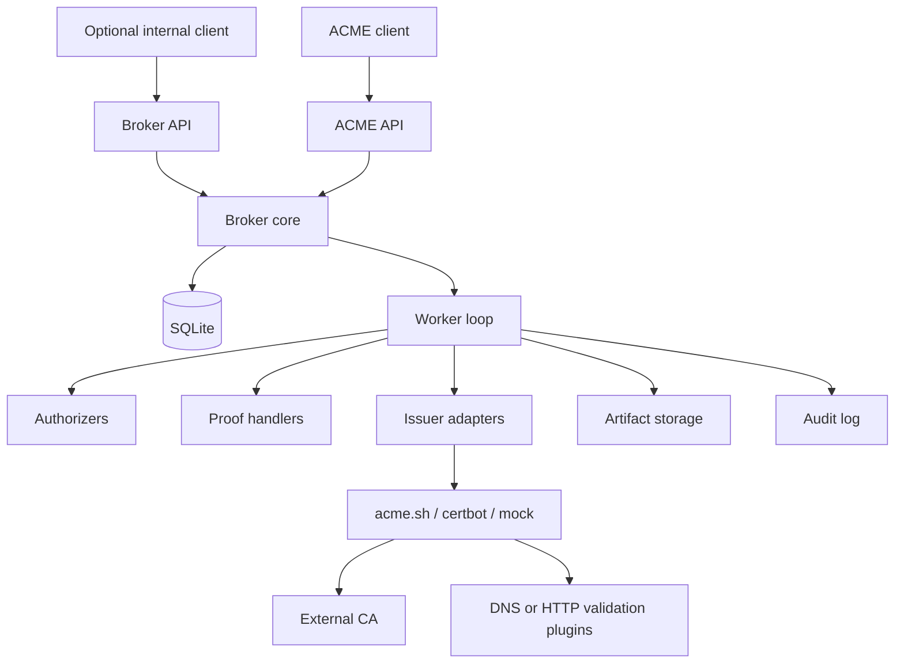
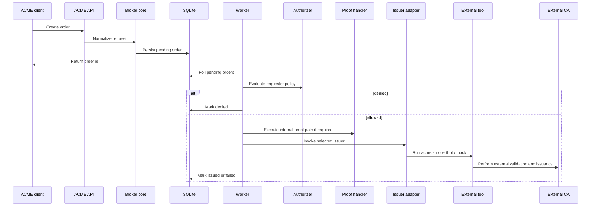

# acmed Architecture

> [!TIP]
> **TL;DR**
> `acmed` should be implemented as a modular monolith: an ACME-facing service around a thin broker core, a worker loop, explicit authorizer and proof boundaries, and issuer adapters that wrap external tools such as `acme.sh` and `certbot`.

Use this document as the source of truth for system shape, component boundaries, and package layout.

Owns: system shape, component boundaries, broker-versus-issuer separation, and package layout.

## 1. Objective

Build a certificate issuance broker that centralizes requester policy while staying small, fast, and understandable.

The architecture should optimize for:

- clear separation between internal requester permissions and external issuer power
- minimal code volume
- low runtime overhead
- safe delegation to external tooling
- straightforward local development
- a core model that describes brokering and orchestration rather than raw ACME protocol mechanics

## 2. Scope

In scope:

- brokered certificate ordering for internal clients
- asynchronous processing
- pluggable authorizers, proof handlers, and issuers
- real external issuer integrations such as `acme.sh` and `certbot`
- persistent runtime state
- auditability
- ACME-compatible inbound interface as the primary surface
- optional broker-native interface as a later extension

Out of scope for v1:

- implementing a full certificate authority
- mirroring every external issuer capability directly to requesters
- clustering or distributed queues
- UI
- advanced multi-tenant isolation

## 3. Architecture Principles

### 3.1 ACME-first edge, broker-style core

The external product surface should be ACME-first, but the internal domain model should still describe certificate brokering:

- who requested a certificate
- what names were requested
- what policy allowed or denied the request
- what internal proof was required
- which issuer profile may be used
- what artifact and audit outputs were produced

External CA challenge execution belongs inside issuer adapters rather than inside the broker core.

### 3.2 Authorization, internal proof, and external validation are different

Use three separate concepts:

- authorization: whether a requester may ask for a certificate at all
- internal proof: optional local evidence or approval required before invoking a privileged issuer
- external validation: the public CA challenge flow carried out by the issuer adapter against the external CA

Do not collapse these into one generic "challenge" abstraction.

### 3.3 Thin broker, not a second CA

For the MVP, prefer:

- one deployable service
- SQLite-backed work coordination
- a polling worker loop
- direct function calls over orchestration frameworks
- subprocess wrappers around existing issuer tools instead of reimplementing their ecosystems
- a few coarse-grained modules over many tiny packages

### 3.4 Centralize broad privileges

Broad external validation credentials such as zone-wide DNS API access should live only with the issuer profile that needs them.

Internal requesters should not receive those credentials, plugin choices, or unrestricted access to invoke them. Policy must mediate all access to privileged issuers.

## 4. System Overview

### 4.1 Core Components

| Component | Responsibility |
|----------|-----------------|
| ACME API | Accept client requests and return ACME-visible resources and errors |
| Broker API | Optional later interface for internal integrations and operations |
| Broker core | Normalize requests, apply policy, and drive state transitions |
| Worker loop | Poll for work and execute authorization, proof, and issuance steps |
| Authorizers | Decide whether the authenticated requester may ask for the requested names |
| Proof handlers | Perform optional local proof or approval steps before issuer invocation |
| Issuers | Wrap external tooling such as `acme.sh`, `certbot`, or a mock issuer |
| Storage | SQLite runtime state plus filesystem artifacts |
| Audit log | Record security-relevant actions and outcomes |

### 4.2 Context Diagram



### 4.3 Recommended Package Layout

```text
src/acmed/
  main.py
  api.py
  acme_api.py
  auth.py
  config.py
  models.py
  policy.py
  storage.py
  worker.py
  audit.py
  issuers/
  proofs/
  authorizers/
```

Split files only after they become materially too large.

For per-file responsibilities and implementation-oriented rules, use [`implementation-guide.md`](./implementation-guide.md).

`main.py` should act as the ACME-first runtime entrypoint:

- load configuration
- initialize storage
- start the worker loop
- construct the HTTP application
- expose ACME routes, admin inspection endpoints, and health endpoints from one service process for the MVP
- mount a broker-native API only when that secondary interface is enabled in a later slice

Do not turn `main.py` into a framework-heavy bootstrap layer in the early milestone.

## 5. Core Flow

The same broker-style core flow should serve the ACME interface first and any later secondary interface without reshaping internals.



## 6. Boundary Rules

| Area | Meaning |
|------|---------|
| Request identity | Who the internal requester is |
| Authorization | Whether that requester may ask for the requested names |
| Proof handler | What extra local evidence or approval is required before invoking an issuer |
| Issuer | Which external tool and credential set may fulfill the request |
| External validation | The CA challenge flow executed by the issuer adapter |

Key rule:

- the issuer may have broader technical power than the requester
- policy decides whether that issuer may be used for this requester and this name set
- requester authorization must never be inferred from the fact that an issuer could technically validate a broader zone

## 7. Related Documents

For topic ownership and navigation, use [`../README.md`](../README.md).

Main companion documents:

- [`overview.md`](./overview.md): project purpose and success criteria
- [`policy-config.md`](./policy-config.md): configuration, issuer profiles, and policy matching
- [`data-model.md`](./data-model.md): lifecycle, persistence, and storage
- [`implementation-guide.md`](./implementation-guide.md): code-shape guidance and test expectations
- [`acme-api-reference.md`](./acme-api-reference.md): primary ACME-facing behavior
- [`broker-api-reference.md`](./broker-api-reference.md): later secondary broker-native HTTP behavior
- [`security-operations.md`](./security-operations.md): security defaults and runtime posture
- [`implementation-plan.md`](./implementation-plan.md): sequencing, iteration scope, and MVP completion
