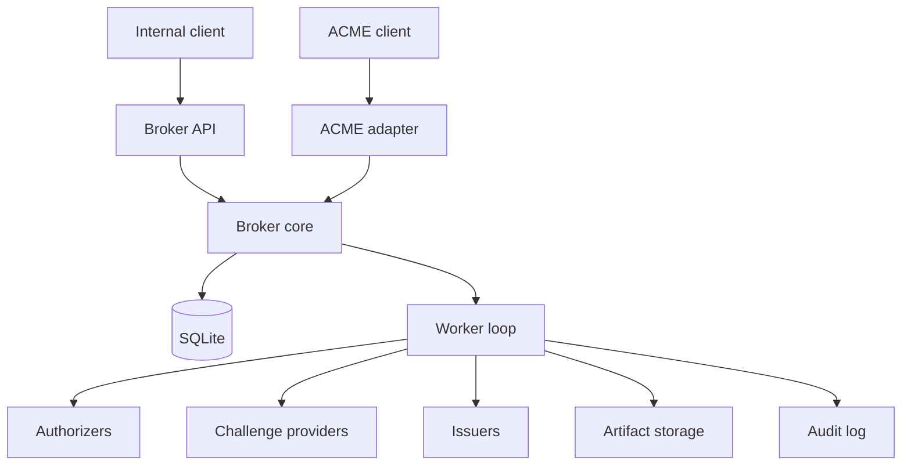
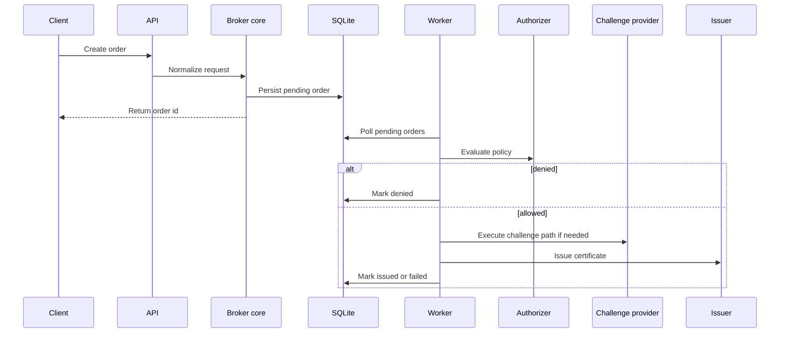

# acmed Architecture

> [!TIP]
> **TL;DR**
> `acmed` should be implemented as a modular monolith: broker core, worker loop, small plugin boundaries, and an optional ACME adapter around the outside.

## 1. Objective

Build a certificate issuance service that centralizes policy decisions while staying small, fast, and understandable.

The architecture should optimize for:

- minimal code volume
- low runtime overhead
- clear failure handling
- straightforward local development
- truthful ACME compatibility without letting ACME shape the core

## 2. Scope

In scope:

- broker-native certificate ordering
- asynchronous processing
- pluggable authorizers, challenge providers, and issuers
- persistent runtime state
- auditability
- optional ACME-compatible adapter

Out of scope for v1:

- full RFC-complete ACME support
- clustering or distributed queues
- UI
- advanced multi-tenant isolation

## 3. Architecture Principles

### 3.1 Broker-first, not ACME-first

The internal domain model must describe certificate brokering, not ACME protocol mechanics.

### 3.2 Authorization and challenge validation are different

Internal policy answers whether a requester may ask for a certificate. Challenge validation answers whether an identifier has been proven in a particular issuance flow.

### 3.3 Simplicity-first implementation

For the MVP, prefer:

- one deployable service
- SQLite-backed work coordination
- a polling worker loop
- direct function calls over orchestration frameworks
- a few coarse-grained modules over many tiny packages

### 3.4 Security-by-default

Basic safety must exist in the first implementation, especially for:

- transport security
- requester identity
- secret handling
- subprocess isolation
- audit redaction

## 4. System Overview

### 4.1 Core Components

| Component | Responsibility |
|----------|-----------------|
| Broker API | Accept broker-native orders and return broker-native status |
| Broker core | Normalize requests, apply policy, and drive state transitions |
| Worker loop | Poll for work and execute authorization, challenge, and issuance steps |
| Plugin set | Authorizers, challenge providers, and issuers |
| Storage | SQLite runtime state plus filesystem artifacts |
| ACME adapter | Expose the documented ACME contract without reshaping the broker core |

### 4.2 Context Diagram



### 4.3 Recommended Package Layout

```text
src/acmed/
  main.py
  api.py
  acme_api.py
  auth.py
  config.py
  models.py
  policy.py
  storage.py
  worker.py
  audit.py
  issuers/
  challenges/
  authorizers/
```

Split files only after they become materially too large.

`main.py` should act as the broker-first runtime entrypoint:

- load configuration
- initialize storage
- start the worker loop
- construct the HTTP application
- expose the broker API, admin inspection endpoints, and health endpoints from one service process for the MVP

Do not turn `main.py` into a framework-heavy bootstrap layer in the broker-first milestone.

## 5. Core Flow



## 6. Workflow Boundary: Broker vs ACME

| Area | Broker-native workflow | ACME workflow |
|------|------------------------|---------------|
| Request identity | Internal requester identity | ACME account key |
| Challenge actor | Service may execute challenge-provider logic | Client fulfills challenge |
| Validation style | Broker-controlled flow | RFC 8555-compatible ACME validation |
| Main purpose | Internal policy-driven brokering | External client compatibility |

The ACME adapter must preserve ACME-visible behavior, but the broker core must stay independent of ACME semantics.

## 7. Where Other Details Live

- Order lifecycle, schema, storage, and config shape: [`data-model.md`](./data-model.md)
- Security rules, runtime topology, and operational handling: [`security-operations.md`](./security-operations.md)
- Delivery sequencing and iteration boundaries: [`incremental-delivery.md`](./incremental-delivery.md)
- Build order, tests, and acceptance criteria: [`implementation-guide.md`](./implementation-guide.md)
- Execution-oriented task sequence: [`implementation-checklist.md`](./implementation-checklist.md)
- ACME-visible protocol behavior: [`acme-api-reference.md`](./acme-api-reference.md)
- ACME client testing and compatibility notes: [`acme-compatibility.md`](./acme-compatibility.md)
